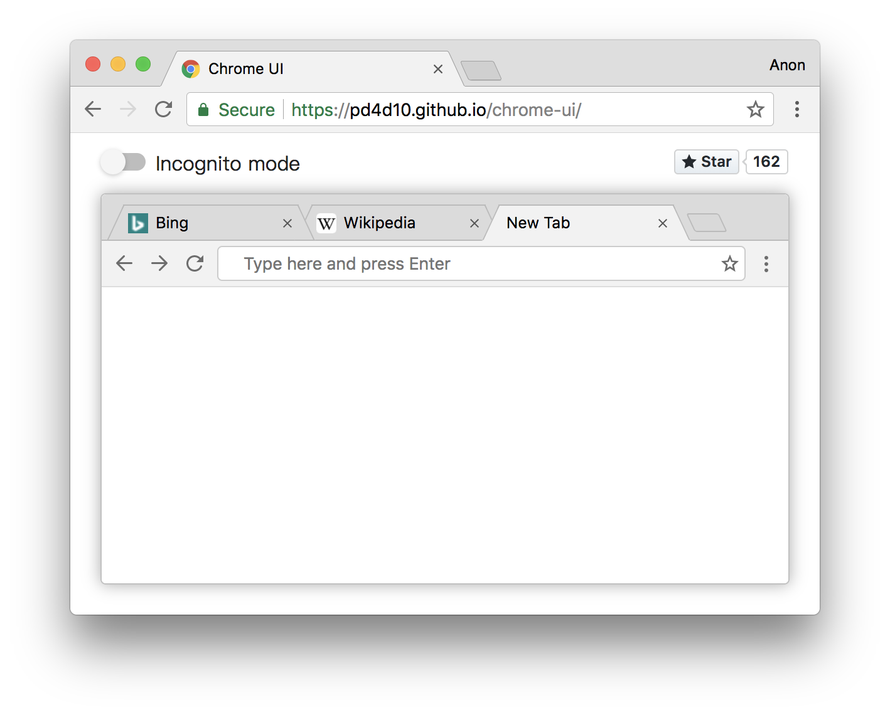

# Chrome UI 

Chrome browser UI built with web technologies. [Live demo](https://pd4d10.github.io/chrome-ui/)

## How does it work?

No magic, just `iframe`, with some trick to make it work as expected :)

## Trouble Shooting

### HTTP site cannot be loaded, will auto redirect to HTTPS

Yes, it is. Because iframes with `src` set to HTTP will be blocked by HTTPS site.

### It shows blank page instead of webpage content

Because the site you visited has HTTP Header Field `X-Frame-Options` set. See http://stackoverflow.com/a/19843216.

Try `www.bing.com` or `en.wikipedia.org` instead.

### It is messed up in my browser

If you find a bug or style mess, please [submit an issue](https://github.com/pd4d10/chrome-ui/issues/new). Thanks!

## License

MIT
